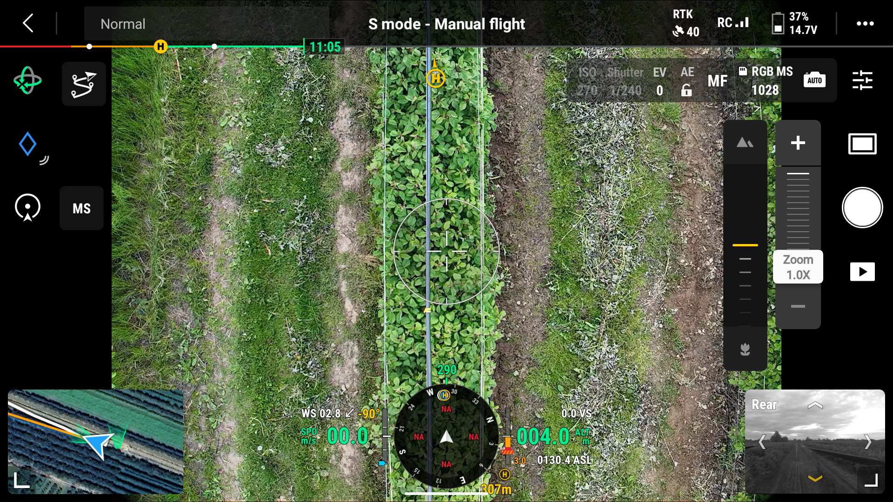
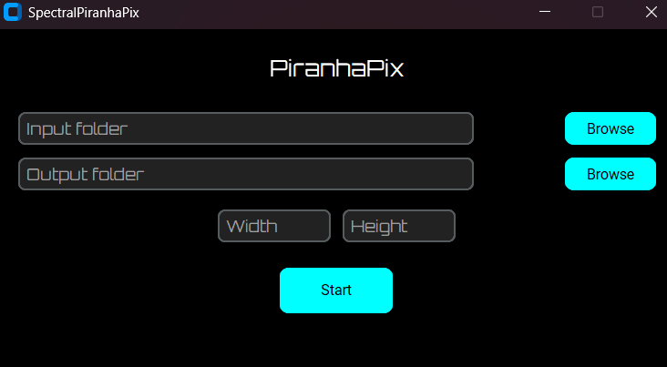
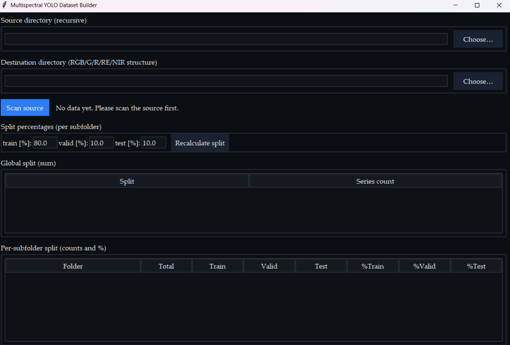

  

 This repository contains all preprocessing, training, and evaluation scripts used in the study “Detection of Raspberry Shrubs from RGB and Multispectral Drone Imagery Using YOLO Models”. The project evaluates YOLOv8s, YOLO11s, and YOLO12s models for the detection of floricane raspberry bushes using RGB and multispectral imagery acquired with a DJI Mavic 3 Multispectral drone.

## Citation
If you use this repository, please cite:
--It will be available after publication--

### 📸 01-ImageScaling.py 
**Purpose:** Batch image rescaling tool with full preservation of EXIF, GPS, and spectral metadata. 

This script provides a graphical interface for batch scaling of TIFF and standard image files. It resizes images to user-defined dimensions using OpenCV and `tifffile`, while maintaining metadata integrity via ExifTool. A minimalist GUI built with CustomTkinter enables quick and intuitive dataset preprocessing prior to YOLO model training.

  

### 📁 02-Organization_of_data_sets.py
**Purpose:** Interactive multispectral dataset builder and splitter for YOLO training pipelines.

This script provides a GUI-based tool for validating, organizing, and splitting multispectral image–label pairs into structured YOLO datasets. It automatically scans subfolders for matching spectral channels (RGB, G, R, RE, NIR), verifies annotation consistency, detects duplicates or missing files, and partitions the data into *train/validation/test* sets by user-defined percentages. Files are moved into a standardized YOLO directory tree (`/images` and `/labels` per spectral band), and a detailed CSV report is generated. The interface offers real-time visual summaries and validation feedback, enabling reliable preprocessing for multispectral deep learning experiments.

  

### 🧠 03-Training.py
**Purpose:** Script for training YOLO-based object detection models on multispectral or RGB datasets.

This script automates the setup and execution of model training using the Ultralytics YOLO framework. It validates the environment configuration (Python, CUDA, PyTorch, cuDNN, GPU availability), verifies YOLO dataset structure integrity, and generates a `data.yaml` file defining training, validation, and test paths. The training loop is executed with user-defined hyperparameters (epochs, batch size, optimizer, learning rates), enabling reproducible experimentation across YOLOv8, YOLO11, and YOLO12 architectures. Training results — including metrics, weights, and logs — are automatically saved to organized `runs/train_*` directories.

### 🧮 04-Model_evaluation_using_test_set.py
**Purpose:** Automated model evaluation and metric extraction on the YOLO test set.

This script evaluates trained YOLO models on the designated *test split*, computing key performance metrics such as Precision, Recall, F1-score, mAP@0.5, and mAP@[.5:.95]. It verifies CUDA availability, loads the model and dataset configuration (`data.yaml`), and executes the evaluation on GPU with full metric logging. Results are saved both as CSV (`metrics_summary_testset.csv`) and JSON (`predictions_testset.json`), while annotated test images with bounding boxes are automatically exported. The pipeline ensures reproducible benchmark evaluation for each spectral or RGB model configuration, supporting both desktop (RTX 5080) and embedded (Jetson Orin NX) environments.

### 💾 05-OutDataAnalysis_Modality_Images.py
Performs a comprehensive cross-modality performance analysis of YOLO models.  

Loads aggregated detection metrics (mAP@50–95) and computes modality-dependent indicators including Relative mAP Retention, Worst-Case Ratio , Cross-Domain Variability. Generates publication-ready heatmaps and comparative bar plots in a unified MDPI visual style, using Palatino/LaTeX typography for consistent scientific formatting.

### 💾 06-OutDataAnalysis_YOLO_Models.py
Performs cross-modality and model-wise performance evaluation for YOLO architectures.  

Aggregates detection metrics (mAP@50–95) across spectral domains and models, computing Relative mAP Retention, Worst-Case Ratio , Cross-Domain Variability to quantify robustness and domain transfer efficiency. Generates publication-grade heatmaps and comparative bar plots (EI, WCR, Stability, in-domain/out-of-domain mAP) in a unified MDPI visual style using LaTeX-based Palatino typography. Outputs complete CSV summaries for further statistical reporting and figure inclusion in manuscripts.

### ⚙️ 07-RTX5080_performance_TORCH.py
Performs systematic benchmarking of YOLO models on an RTX 5080 GPU under FP16 precision.  

Implements laboratory-grade performance testing with clock stabilization, warm-up and timed inference cycles, and per-session cooldown control. Measures key runtime metrics including FPS, latency, jitter, and the mAP/FPS efficiency ratio across multiple models and sessions. Generates detailed per-session and global summaries in Excel format (runs + statistical overview), enabling reproducible hardware-level performance analysis and inter-model comparison.

### ⚙️ 08-JetsonOrinNX_performance_TORCH.py
Executes multi-model YOLO benchmarking on the NVIDIA Jetson Orin NX platform (FP16 precision).  

Applies the same methodology as the RTX 5080 benchmark, adapted for embedded hardware — including reduced warm-up cycles, extended cooldowns, and thermal throttling prevention. Measures FPS, latency, jitter, and mAP/FPS efficiency across multiple models, performing clock stabilization and trimmed statistical averaging for reliability. Saves per-session and global benchmark reports (runs + summaries) in Excel format, enabling reproducible on-edge performance profiling and cross-device comparison.

### 📈 09-Torch_TO_Tensor.py
Automates the export of trained YOLO models from PyTorch (`.pt`) format to TensorRT (`.engine`) for deployment.  

Recursively scans training directories, detects all `best.pt` checkpoints, and converts them using FP16 precision with optimized GPU workspace allocation.  Supports automatic naming based on modality and model type, generating reproducible and deployment-ready TensorRT engines for Jetson or desktop inference environments. Logs export progress and performance for each model, ensuring full transparency of conversion outcomes.

### ⚙️ 10-JetsonOrinNX_performance_TENSOR.py
Performs TensorRT-based YOLO benchmarking on the NVIDIA Jetson Orin NX under FP16 precision.  

Implements a one-to-one methodology with the Torch benchmark for strict comparability — including clock stabilization, warm-up cycles, trimmed timing, and inter-session cooldowns.  Evaluates real-time performance (FPS, latency, jitter) of all TensorRT `.engine` models and computes mAP/FPS efficiency ratios. Automatically aggregates results into per-session and master Excel files, enabling quantitative cross-platform evaluation between Torch and TensorRT backends.

### 📊 11-Torch_and_Tensor_PERFORMANCE_Analysis_Mean_Std.py
Processes benchmark results from Torch and TensorRT evaluations to compute descriptive statistics per model.  

Calculates mean, standard deviation, median, and coefficient of variation (CV%) for FPS, latency, and mAP/FPS ratio across all benchmark runs. Provides a consolidated Excel summary with high-precision values, serving as the final step in quantitative performance analysis for publication and reproducibility.

### 📄 12-Performance_Analysis_Results_from_XLSX_to_DOCX_Table.py
Converts final YOLO performance statistics from Excel into a publication-ready Word table (MDPI/IEEE format).  

Applies standardized numerical rounding, disables scientific notation, and formats all cells with consistent borders and font size. Generates a fully styled `.docx` table including caption and metric definitions, suitable for direct inclusion in academic papers or reports.

